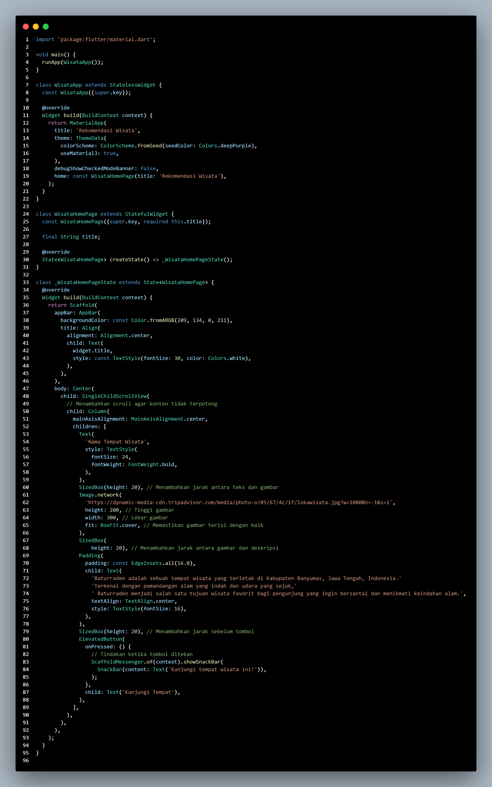

# Source Code

# Output

# Deskripsi Program

Program di atas adalah aplikasi Flutter sederhana yang berfungsi untuk menampilkan informasi tentang tempat wisata bernama Baturraden. Algoritma kerja program ini dimulai dengan memanggil main() yang menjalankan aplikasi dengan runApp(WisataApp()). Aplikasi ini menggunakan MaterialApp sebagai wadah utama yang mengatur tema dan tampilan aplikasi, serta mendefinisikan halaman utama (WisataHomePage) yang menampilkan konten.

Proses selanjutnya adalah dalam kelas WisataHomePage, di mana kita membangun antarmuka pengguna dengan menggunakan Scaffold, yang menyediakan struktur dasar untuk aplikasi, termasuk AppBar dan body. Di dalam body, terdapat SingleChildScrollView yang memungkinkan pengguna untuk menggulir konten yang mungkin tidak muat di layar, berisi kolom teks, gambar, deskripsi, dan tombol. Ketika tombol ditekan, aplikasi menampilkan SnackBar dengan pesan yang mengajak pengguna untuk mengunjungi tempat wisata tersebut.

Output yang dihasilkan dari program ini adalah sebuah antarmuka pengguna yang menampilkan judul, gambar, deskripsi tempat wisata, dan tombol interaktif. Dengan pendekatan ini, pengguna dapat dengan mudah melihat informasi terkait Baturraden dan mendapatkan akses ke interaksi sederhana dengan aplikasi.