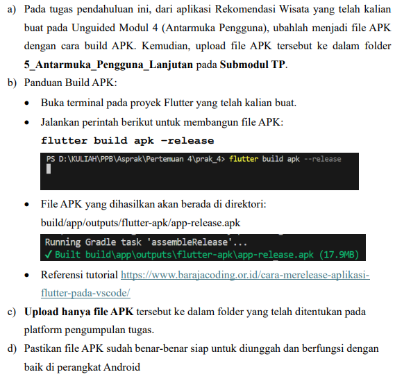
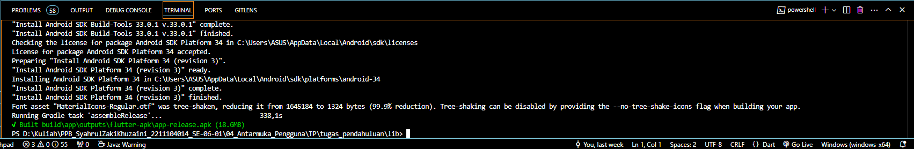
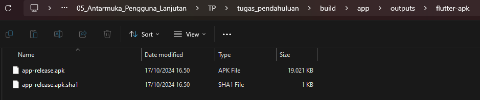

# Cover 

TUGAS PENDAHULUAN  
PEMROGRAMAN PERANGKAT BERGERAK  
 
MODUL V  
ANTARMUKA PENGGUNA LANJUTAN  

 

Disusun Oleh:  
Syahrul Zaki Khuzaini/2211104014  
SE-06-01  

 

Asisten Praktikum :  
Muhammad Faza Zulian Gesit Al Barru  
Aisyah Hasna Aulia  

 

Dosen Pengampu :  
Yudha Islami Sulistya, S.Kom., M.Cs  

 

PROGRAM STUDI S1 REKAYASSA PERANGKAT LUNAK  
FAKULTAS INFORMATIKA   
TELKOM UNIVERSITY PURWOKERTO  

## Tugas Pendahuluan
---

### A. Soal  

     

#### Source Command  

     

#### Screenshot Output 

     

#### Deskripsi Program  
Command tersebut digunakan untuk membuat file APK dalam mode release, yang siap di-deploy ke pengguna atau diunggah ke Play Store. Mode ini mengaktifkan optimisasi, menghapus log debug, dan meminimalkan ukuran APK agar aplikasi lebih ringan. Selain itu, mode release menonaktifkan debugging, sehingga aplikasi lebih aman dan stabil. Proses kompilasi menggunakan Ahead-of-Time (AOT) untuk mengonversi kode Dart ke kode mesin yang lebih cepat. Hasil APK dalam mode ini sudah ditandatangani digital dan siap untuk distribusi produksi.