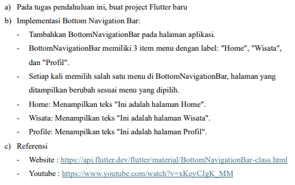
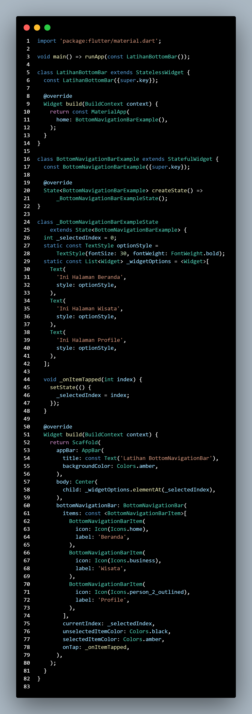
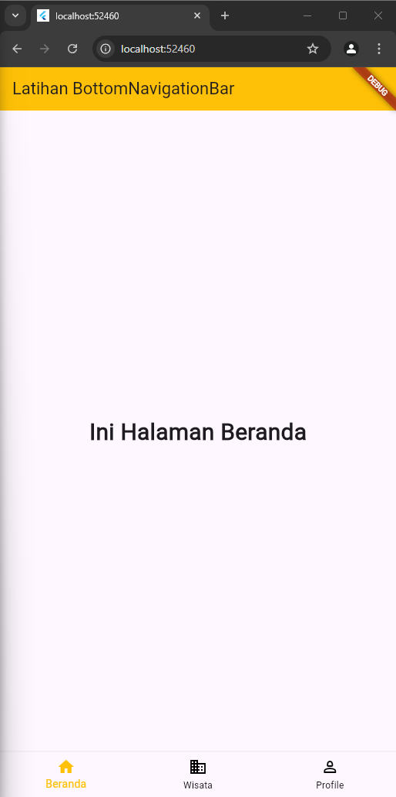
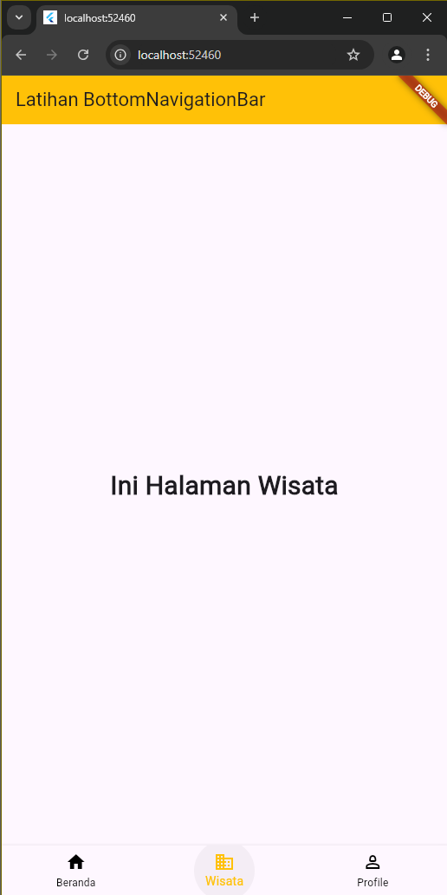
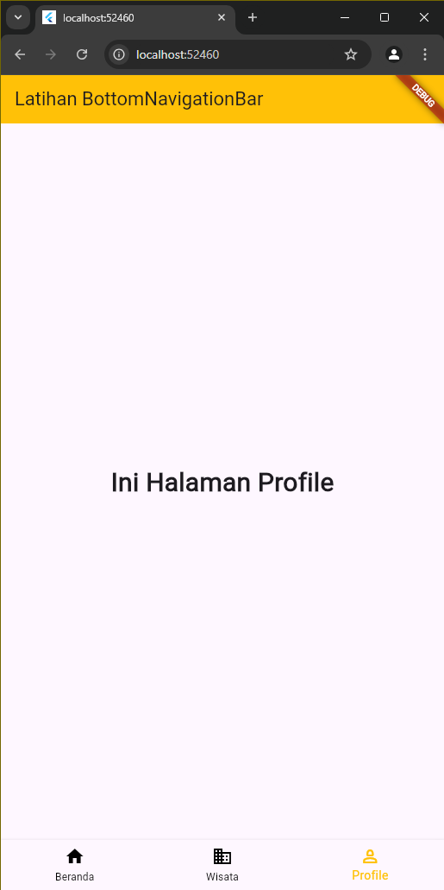

# Cover 

TUGAS PENDAHULUAN  
PEMROGRAMAN PERANGKAT BERGERAK  
 
MODUL VI  
INTERAKSI PENGGUNA  

 

Disusun Oleh:  
Syahrul Zaki Khuzaini/2211104014  
SE-06-01  

 

Asisten Praktikum :  
Muhammad Faza Zulian Gesit Al Barru  
Aisyah Hasna Aulia  

 

Dosen Pengampu :  
Yudha Islami Sulistya, S.Kom., M.Cs  

 

PROGRAM STUDI S1 REKAYASSA PERANGKAT LUNAK  
FAKULTAS INFORMATIKA   
TELKOM UNIVERSITY PURWOKERTO  

## Tugas Pendahuluan
---

### A. Soal  

 

#### Source Code  
   

 

#### Screenshot Output 

 

#### Deskripsi Program  
Kode di atas membuat aplikasi Flutter dengan BottomNavigationBar yang menampilkan tiga halaman berbeda: Beranda, Wisata, dan Profile. Aplikasi ini menggunakan StatefulWidget untuk mengelola perubahan halaman saat pengguna mengetuk ikon di bawah. Setiap kali ikon dipilih, indeks (_selectedIndex) diperbarui dan halaman yang sesuai dari daftar _widgetOptions ditampilkan di bagian tengah layar. BottomNavigationBar juga diatur dengan warna item terpilih menjadi amber, sedangkan item yang tidak dipilih berwarna hitam.