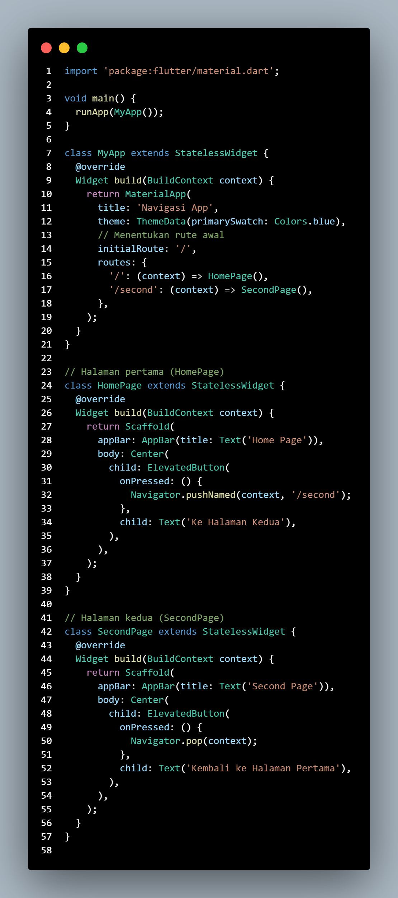
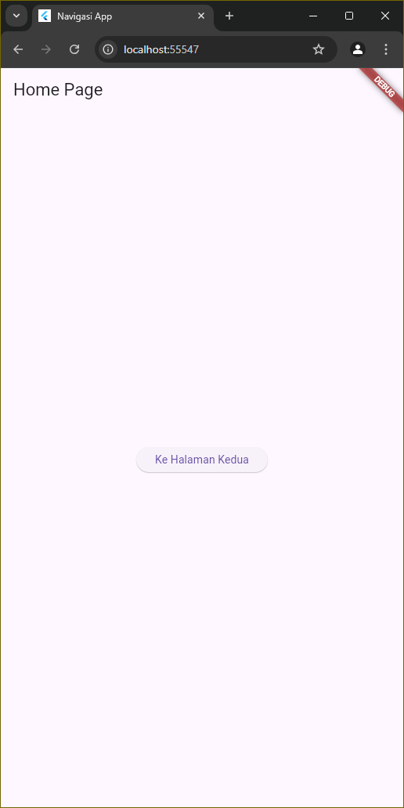
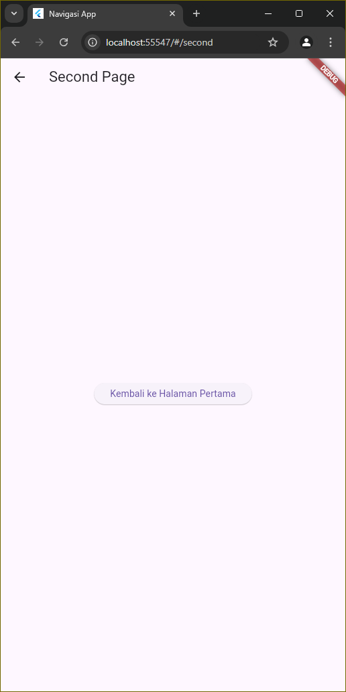

# Cover 

TUGAS PENDAHULUAN  
PEMROGRAMAN PERANGKAT BERGERAK  
 
MODUL VII  
NAVIGASI DAN NOTIFIKASI  

 

Disusun Oleh:  
Syahrul Zaki Khuzaini/2211104014  
SE-06-01  

 

Asisten Praktikum :  
Muhammad Faza Zulian Gesit Al Barru  
Aisyah Hasna Aulia  

 

Dosen Pengampu :  
Yudha Islami Sulistya, S.Kom., M.Cs  

 

PROGRAM STUDI S1 REKAYASSA PERANGKAT LUNAK  
FAKULTAS INFORMATIKA   
TELKOM UNIVERSITY PURWOKERTO  

## Tugas Pendahuluan
---

### A. Soal  
a. Buatlah satu project baru, yang mana di dalamnya terdapat navigasi untuk pindah
dari satu halaman ke halaman lainnya
 

#### Source Code  
   

 

#### Screenshot Output 

 

#### Deskripsi Program  
Kode tersebut adalah sebuah proyek Flutter sederhana dengan navigasi antar halaman. Di dalam main.dart, fungsi main memulai aplikasi, dan widget MyApp mengatur tema serta rute halaman. HomePage memiliki tombol yang menggunakan Navigator.pushNamed untuk berpindah ke SecondPage, sedangkan SecondPage memiliki tombol untuk kembali ke HomePage dengan Navigator.pop. Dengan struktur ini, pengguna dapat berpindah antar halaman dengan mudah menggunakan nama rute yang sudah ditentukan.