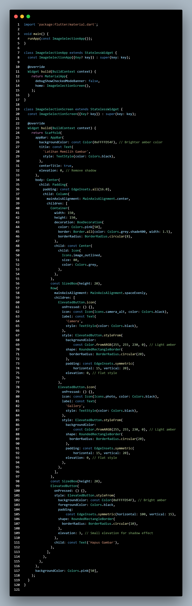
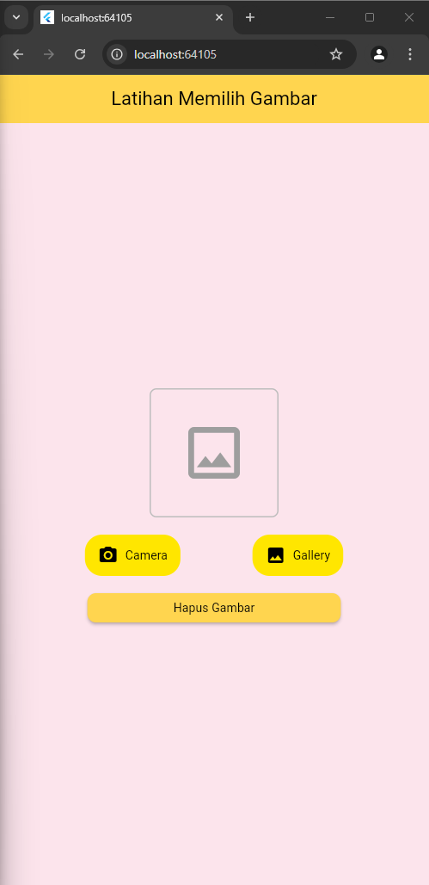

# Cover 

TUGAS PENDAHULUAN  
PEMROGRAMAN PERANGKAT BERGERAK  
 
MODUL IX  
API PERANGKAT KERAS  

 

Disusun Oleh:  
Syahrul Zaki Khuzaini/2211104014  
SE-06-01  

 

Asisten Praktikum :  
Muhammad Faza Zulian Gesit Al Barru  
Aisyah Hasna Aulia  

 

Dosen Pengampu :  
Yudha Islami Sulistya, S.Kom., M.Cs  

 

PROGRAM STUDI S1 REKAYASSA PERANGKAT LUNAK  
FAKULTAS INFORMATIKA   
TELKOM UNIVERSITY PURWOKERTO  

## Tugas Pendahuluan
---

### A. Soal  
a. Buatlah satu project baru, yang mana di dalamnya memuat container berisi
Icons.image_outlined, button camera, button gallery dan button hapus gambar.
Button tidak harus berfungsi.
 

#### Source Code  
   

 

#### Screenshot Output 

 

#### Deskripsi Program  

Kode di atas membuat aplikasi Flutter dengan antarmuka yang menampilkan judul "Latihan Memilih Gambar" di dalam AppBar berwarna kuning terang. Pada bagian tengah layar terdapat ikon gambar dalam container berbingkai abu-abu, mewakili tempat untuk memilih gambar. Di bawah ikon, terdapat dua tombol dengan ikon, "Camera" dan "Gallery," yang berwarna kuning pucat dengan desain datar dan sudut membulat. Di bawah tombol tersebut, ada tombol "Hapus Gambar" berwarna kuning yang sedikit lebih besar dan memiliki efek bayangan untuk memberikan tampilan yang menonjol.